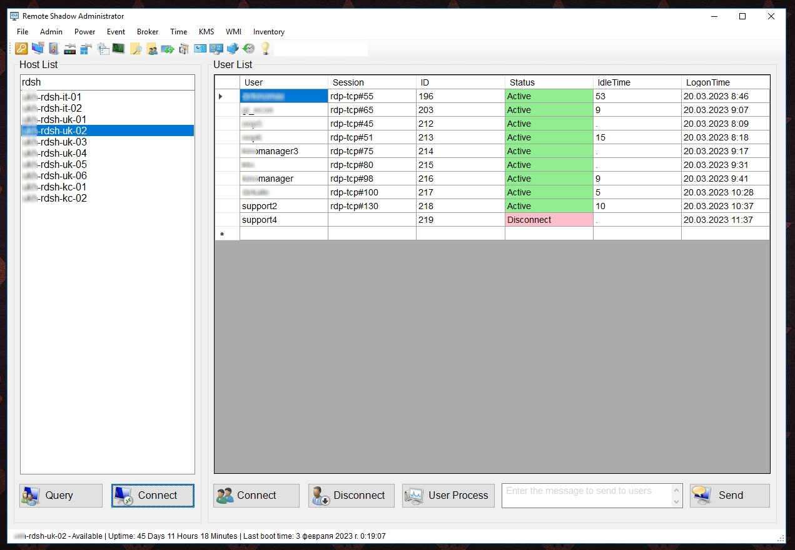
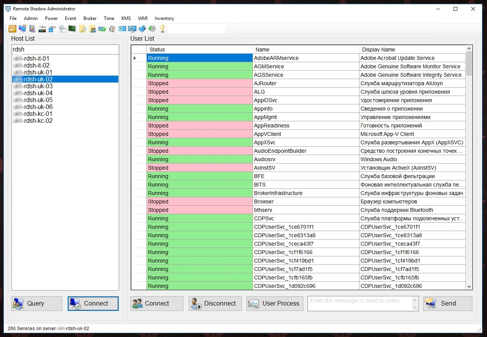
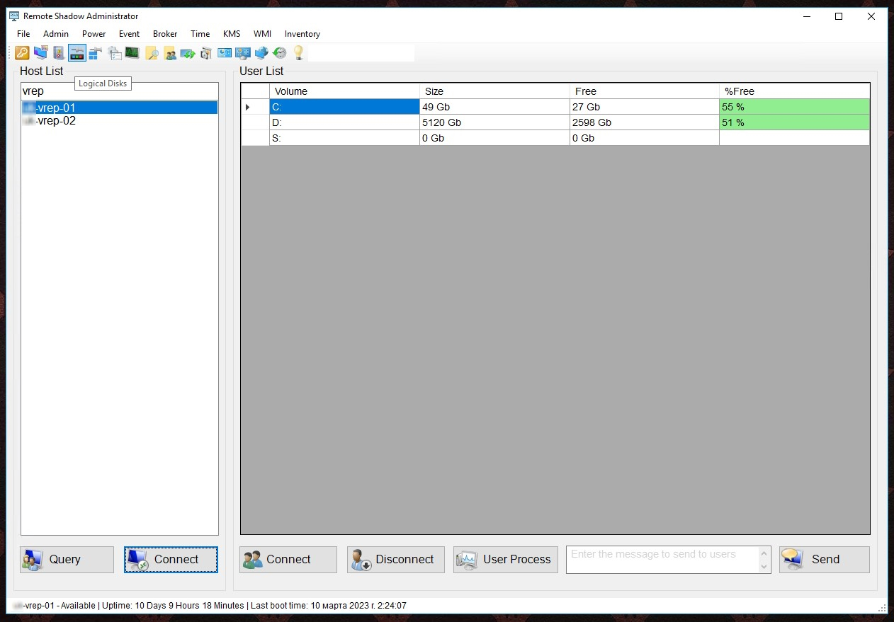

<h1 align="center">
     RSA (Remote Shadow Administrator)
</h1>

<h4 align="center">
    <strong>English</strong> | <a href="README_RU.md">Русский</a>
</h4>

GUI for managing connections to current `RDP` sessions via **Shadow connections**, and also contains a set of functions for remote interaction with the Windows operating system and automation of the administration process.

Can be used as an alternative to remote connection tools such as [Radmin](https://www.radmin.com) or [TightVNC](https://www.tightvnc.com), which require client-server software installation. Written in Windows PowerShell using [Windows Forms](https://en.wikipedia.org/wiki/Windows_Forms), does not contain module dependencies. Tested on Windows Server 2016, 2019 DC and Windows 10 Pro systems in Russian and English localizations.

**[🚀 Download RSA.exe](https://github.com/Lifailon/RSA/releases/latest)**

When you select a server and click the `Query` button, a list of current users is displayed in the form of a table. The host's availability is preliminarily checked by means of `ping` and `WinRM`, as well as `uptime` with output to the status bar. To change the list of computers, select **File - List Change** (`Ctrl+S`) in the menu, and to update the list **List Update** (`Ctrl+R`). When selecting a user, four actions can be performed: **Connect** (Shadow connection) with the ability to request a connection and without (the latter is conveniently configured via `GPO`), disconnecting the user (logging out of the system), displaying a list of running user processes with the ability to terminate them (by editing the mouse button on the selected process - **Stop Process**) and sending the typed message to all users on the server or selected in the table. It is possible to fill the list of servers with **AD computers** (`Ctrl+D`) and also to display the list in table format (`Ctrl+T`) with the ability to sort and interact with the selected computer.

To connect to the server via `RDP`, `mstsc` is used with the `/admin` key, which allows you to connect to the `RDSH` server bypassing the Broker for distributing connections. `cmdkey` is used for authentication, after passing a one-time authentication (`File` - `Authentication`), preliminary authentication occurs for all servers in the list and is valid until the program is closed, which allows you not to store the administrator password in the code, as well as the OS key storage (which can be compromised).

## Add-ons

- **Admin - Services** - displays a list of services on a local or remote computer with the ability to restart and stop them.
- **Admin - All Remote User Process** - is used to display a list of all user processes with the ability to stop them.
- **Admin & WMI - Software** - displays a list of installed software with the ability to remove it
- **WMI - Windows Update** - displays a list of updates with further search by `HotFixID` in `DISM Packages` and removal.
- **Admin - SMB Open Files** - displays a list of network resources used by users on the network with the ability to close their sessions.
- **Admin - Get-Netstat** - displays a list of listening and established TCP connections with conversion of the remote host name (`nslookup`) and the process used.
- **Admin - Get-RemoteDNS** - used to remotely view on a `DC` (does not require installation of the module from the `RSAT`) the list of all `DNS` zones and child records of the selected zone with the ability to delete the selected record.
- **Admin - GPUpdate** - updating group policies on a remote computer.
- **Admin - GPResult** - generating a summary report on the results of group policies in `HTML` format for the specified user on the selected host.
- **Power - Reboot & Power Off** - reboot or power off the host with a 60-second delay.
- **Power - Screen lock & Sleep mode** - enabling/disabling screen lock and sleep mode on a remote computer.
- **Power - Get-ARP & Get-DHCP** - used to find the MAC address of a turned off computer in order to turn it on using `WOL` (Wake-on-Lan).
- **Event** - power logs and five event logs for session analysis (connections and disconnections).
- **Broker** - automation of cmdlets for interaction with the `RDSH` farm.
- **WMI - Logical Disk & Memory** - displays the total and available volume of local disks and RAM.
- **WMI - Drivers** - display a list of drivers.
- **WMI - File Share** - a list of public resources on the host (directories or printers).
- **WMI - Power RDP & Power NLA** - checks the status of `RDP` (Remote Desktop Protocol) and `NLA` (Network Level Authentication) on a remote host with the ability to enable and disable.
- **WMI - Setup** - installing software on a remote computer (via `install-package` or `WMI`).

### Scripts for synchronizing computer clocks (w32tm)

- Displays the current time on the server and the difference with the source server.
- Find out the time source, as well as the frequency and time of the last synchronization (the latter is displayed depending on the language pack on the remote machine).
- Check the server as a time source.
- Change the time source on the remote server to the nearest `DC` (with the `PDC` role) in the subnet.
- Change to an external time source (for example, `ru.pool.ntp.org`).
- Immediately synchronize the time on the remote server with the source.

### Scripts for activating corporate licenses in the network (KMS)

- Find out the OS edition and version, license acquisition channel, key type, activation status and licensing server.
- Find out the address of the KMS server in the network by srv record.
- `GVLK` activator. Contains public keys `GVLK` (Generic Volume License Key) with the ability to activate remotely.
- Manually specify the KMS server (for example, if the KMS server is not published in DNS).
- Request (update) the license from the KMS server.
